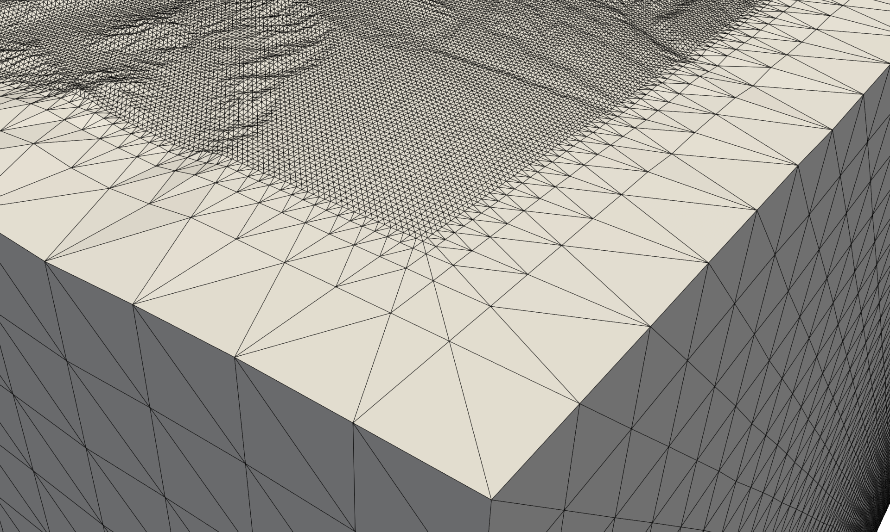

EDGEcut
=======
EDGEcut is a tool for generating surface meshes for a computational domain with topography.
It takes as input a regular sampling from a topographical profile and generates a simple triangular
surface mesh using a six-sided box.
The topography is sampled at the same resolution as the input whereas the other five sides can be coarsened.
The topography mesh and boundary mesh are then output in `OFF format <https://people.sc.fsu.edu/~jburkardt/data/off/off.html>`_
as separate files.
The tool `meshio <https://github.com/nschloe/meshio>`_ can be used for mesh-format conversions.
EDGEcut's output is the input for volume mesher, e.g., Gmsh.

.. figure:: edge_cut_la_habra_box.png
  :align: center

  Meshed box for the La Habra region.

Zoom showing the triangulation and side-coarsening for the box above.

Configuration
-------------
Documentation for EDGEcut's runtime configuration and DEM-input hasn't been written yet.
You may checkout the :edge_opt:`surface meshes <bench/seismic/wp/la_habra/meshes/surface>` of the La Habra setups for an example.